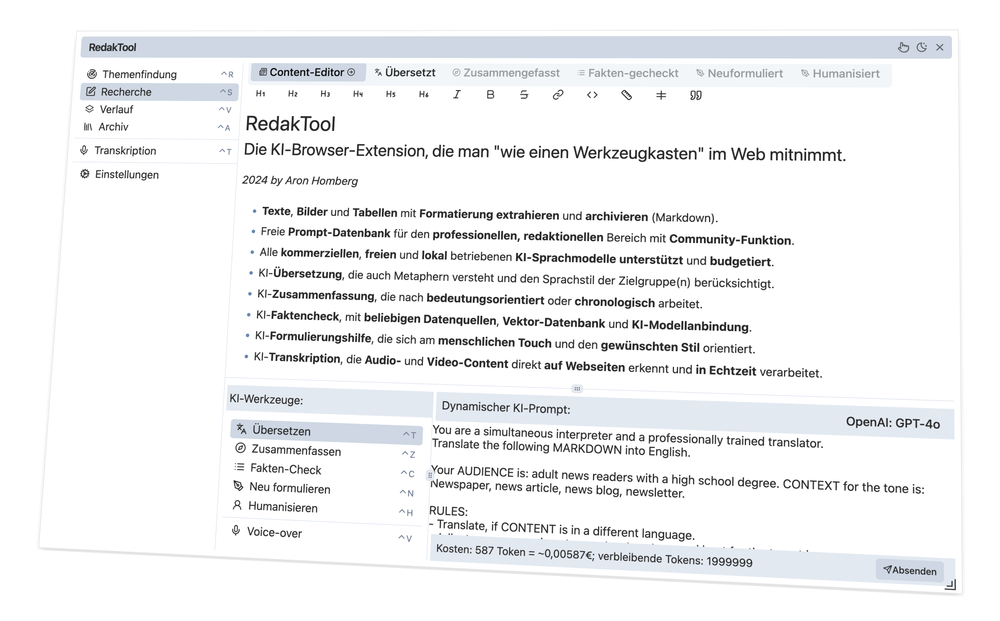
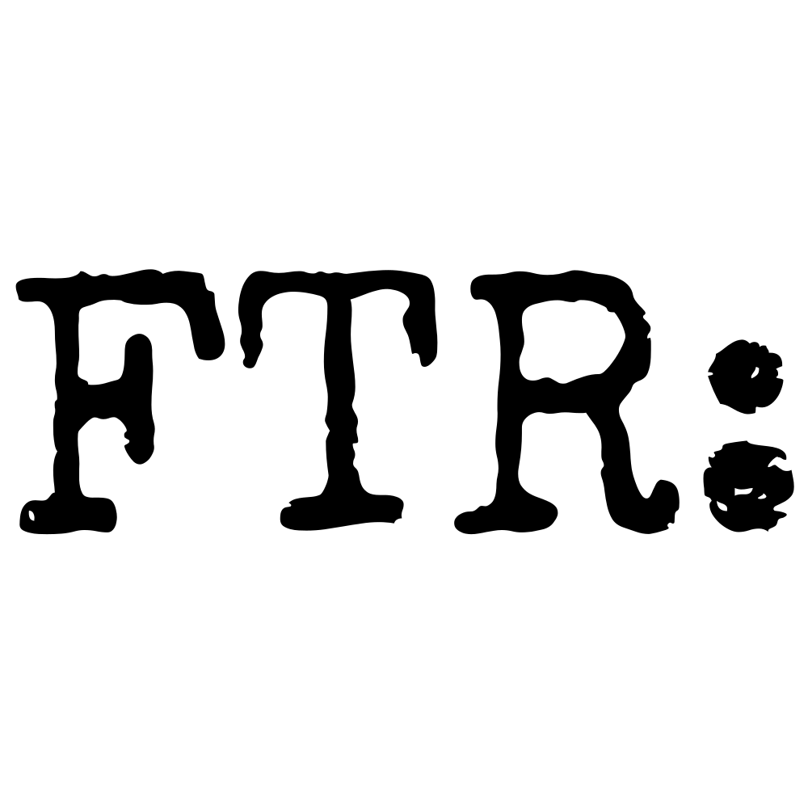

<span align="center">
    <p align="center">
      
    </p>

  # RedakTool


  ### Browser Extension - for the journalistic work of the future

  <font color="#555">
  
  #### &ndash; IN DEVELOPMENT | PRE-ALPHA &ndash;

  </font>


  [](#-features)  [](#-usage)   [](https://github.com/kyr0/redaktool/wiki) [](#%EF%B8%8F-contibuting)  
  [](https://discord.gg/4wR9t7cdWc) [](mailto:info@aron-homberg.de) [](#%EF%B8%8F-acknowledgements)

</span>

> 🛠️ RedakTool offers a powerful browser extension specifically designed for editors and professionals engaged in text-related research, writing, and evaluation tasks. This tool serves as a comprehensive "AI toolbox" enabling direct interaction with content on any website for extraction, translation, summarization, composition, and proofreading. It includes additional functionalities like a News Radar, transcription services, and robust fact-checking features. Aimed at boosting productivity, the extension streamlines workflows by eliminating the need for multiple tools, thereby reducing the mental burden and decreasing costs through the direct integration of both commercial and open-source AI models. 

> 🔬 Additionally, this project showcases the practical application of cutting-edge AI technologies such as nomic-embed-text-v1 for client-side, in-browser usage (through my open source [`vectorstore`](https://github.com/kyr0/vectorstore/) project), marking a significant step forward in the accessibility and application of advanced AI <strong>without the need for</strong> server-side deployments.

## 🌟 Features
<span align="center">

  

</span>

RedakTool offers the following features:

- ✅ **Advanced Text, Image, Table Data Extraction and Archiving**: Allows users to extract content from any website, and save it in Markdown format with a single click. The archive search applies local  vector search to find similar texts.
-  ✅ **AI Translation**: Adapts translations to account for metaphors, style, and target audience considerations.
-  ✅ **AI Summarization**: Focuses on summarizing content based on importance or chronology, suitable for interviews.
-  ✅ **AI Creating Writing**: Assists in rephrasing and styling content.
-  ✅ **AI Transcription**: Provides nearly error-free real-time transcription of audio and video on websites.

AI models supported:
-  ✅ **OpenAI**: Any OpenAI LLM, including GPT-4 and newer models.
-  ✅ **Anthropics**: The whole Claude model-series, including Opus.
-  ✅ **Google**: The whole Gemeni model-series, including 1.5 Pro.
-  ✅ **Cohere**: The whole Command model-series, including Command R Plus.
-  ✅ **Ollama**: All Ollama LLMs, including Llama 3.
-  ✅ **HuggingFace**: All HuggingFace LLMs.

This extension also allows to configure and use locally deployed models, as long as there is an endpoint compatible with the industry-standard OpenAI Messages API interface (fully compatible with OpenAI Chat Completion API).
 
Additional features planned:
-  ✅ **AI Fact-Checking**: Offers fact-checking with minimized errors and simulates human touch and style.
-  ✅ **AI News Radar**: Ingests all news sources, added to the radar via RSS/Atom feeds, applies AI vector similarity algorithms to link similar news.

## 📚 Usage

**Please be aware that this extension is currently in the ALPHA stage and is not ready for general user installation. If you're interested in using the extension at this time, you will need to compile it on your own machine. To do this, please refer to the "Contributing as a Developer" guide provided below.**

**We anticipate moving into the beta testing phase within the next 1-2 months. At that time, the process for installing and using the extension will become more straightforward for general users. Stay tuned for further updates, and thank you for your interest and patience!**

Currently, this extension is tested for compatibility with Chrome and Chromium browsers. 

Here’s how to get started:

- Open your Chrome or Chromium browser.
- Navigate to Extensions. You can do this by typing chrome://extensions into your browser's address bar.
- Click on the Load unpackaged extension button. For German users, this option is labeled "Entpackte Erweiterung laden".
- Select the directory where you've saved the extension files. The extension will then be installed automatically.
Activating the Extension
You can activate the extension on any website in a few simple ways:

- Use the keystroke Alt+F on Windows or Control+F on Mac.
- Alternatively, click on the extension’s menu entry in Chrome's extension dropdown.

## ⚒️ Contibuting

### As a User 
This project, crafted by a writer and software engineer, is designed with you in mind—it thrives on your participation! Your unique insights and contributions can truly enrich this community. If you're willing to share a bit of your valuable time and energy, here are several ways you can make a meaningful impact:

- Share your feedback and thoughts
- Suggest **new prompts** or **refine** existing ones
- Propose new or alternative use cases
- Provide test results, including compatibility, speed, and overall experience
- Report any issues you encounter

Your involvement is invaluable and deeply appreciated!
Please feel free to reach out to me via our Discord channel *(preferred)* or via email.

### As a Developer

You're very welcome to contribute to this project. You may need to install [`bun`](https://bun.sh/) first.

To install dependencies:

```bash
bun install
```

To run:

```bash
bun dev
```

This command will compile a new version of this extension  that you can load in Chrome/Chromium (load unpackaged extension from disk).

Your contributions are welcome!

- **Feature Development**: Extend RedakTool by adding more features and integrations. You may fork this repository, create a new branch, implement another Tab or Menu Entry for your new feature, and open a Pull Request here. Please simply follow the code-style and general architecture of this codebase.
- **Reporting Bugs**: Submit an issue in our repository, providing a detailed description of the problem and steps to reproduce it. A usage video works best.
- **Feature Requests**: Have ideas on how to make this extension better? We'd love to hear from you! Please submit an issue, detailing your suggestions.

### Versioning note

Until end of October 2024, this project will apply a specific versioning scheme, that adds a tag to the semver version: 
`0.0.0-increment-$milestone.$month.$week`. This is, to track and group the progress in `CHANGELOG.md` on a per-milestone, per-month, per-week, basis, in increments.

### Conventional Commits

To organize the work done, alongside it's documentation, every commit follows a the [Conventional Commits](https://www.conventionalcommits.org/en/v1.0.0/) policy. This allows for `bun run changelog` to auto-generate the changelog with meaningful process reports every Tuesday evening. 

## ❤️ Acknowledgements

Special thanks to our contributors and supporters, particularly Media Tech Lab, for their invaluable assistance in this project.

<a href="https://www.media-lab.de/en/programs/media-tech-lab">
    
</a>

